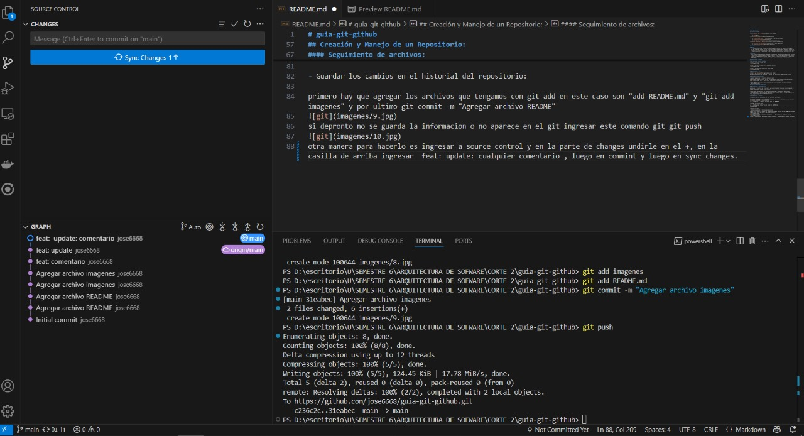
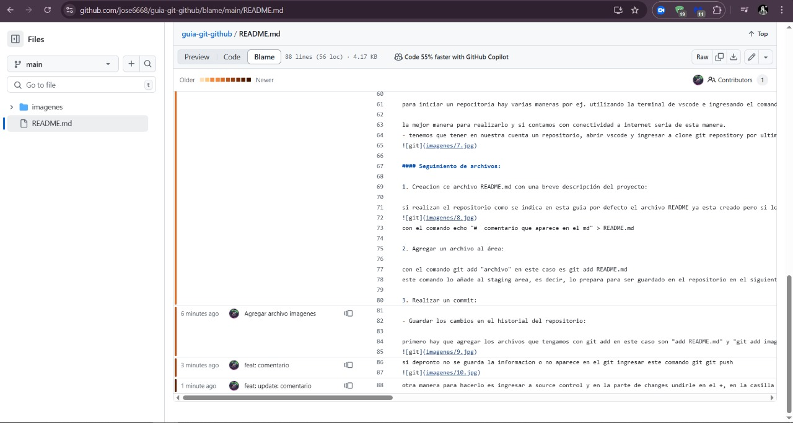
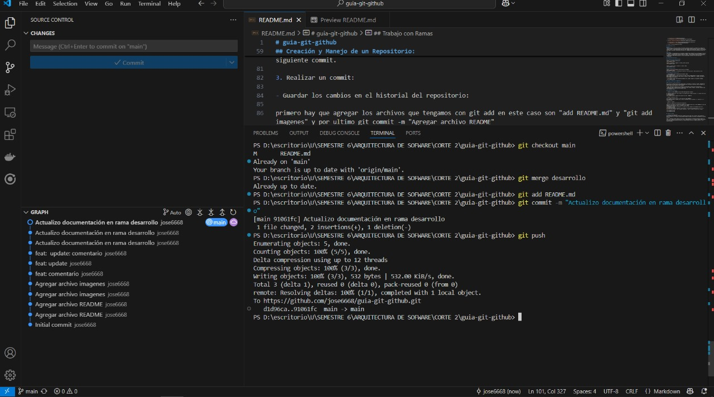
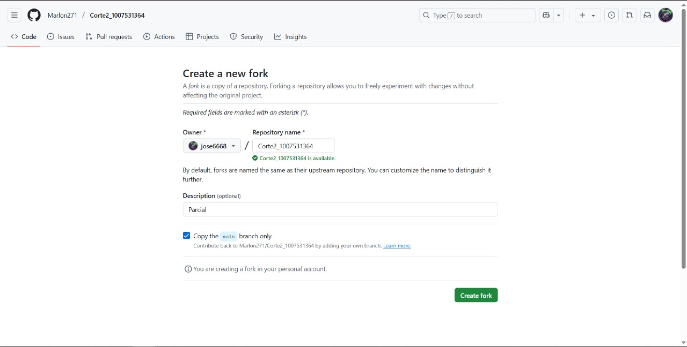
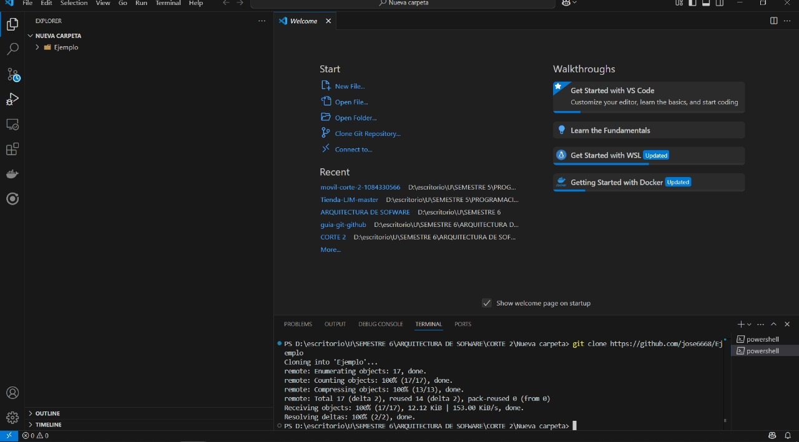
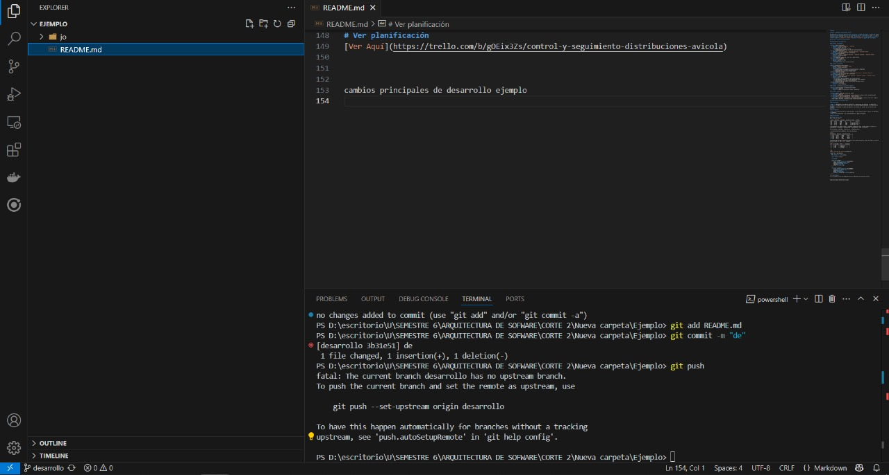
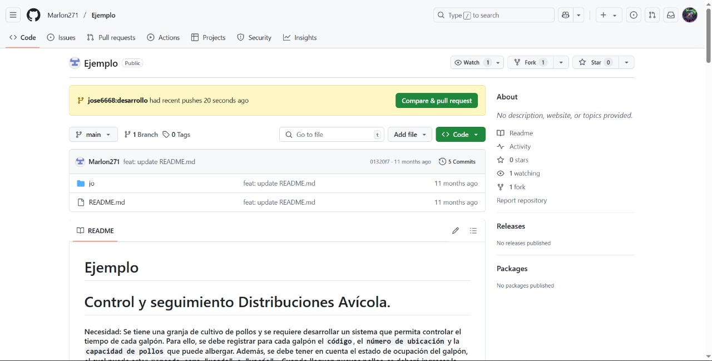
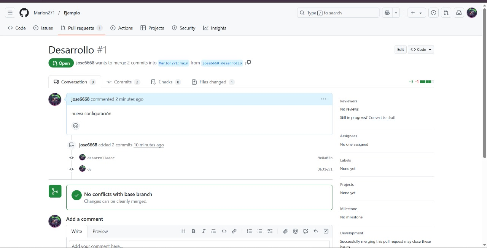

# guia-git-github

## Tabla de contenido 

1. [Introducción a Git y GitHub](#Introducción-a-Git-y-GitHub)

    - [Git](#git)  
    - [Git](#github)  
2. [Configuración del Entorno](#configuración-del-entorno)

    - [Creación de una cuenta en GitHub](#creación-de-una-cuenta-en-github)   
    - [Instalación de Git](#instalación-de-git)  
    - [Configuración Inicial de Git](#configuración-inicial-de-git)

3. [Creación y Manejo de un Repositorio](#creación-y-manejo-de-un-repositorio)

    - [inicializar un nuevo repositorio](#inicializar-un-nuevo-repositorio)   
    - [Seguimiento de archivos](#seguimiento-de-archivos)  

4. [Trabajo con Ramas](#trabajo-con-ramas)

    - [Creación de una nueva rama](#creación-de-una-nueva-rama)  
    - [Fusión de ramas](#fusión-de-ramas)

5. [Publicación en GitHub](#publicación-en-github)

6. [Colaboración y Pull Requests](#colaboración-y-pull-requests)
    -[Fork de un repositorio existente](#fork-de-un-repositorio-existente)   
    -[Clonar el repositorio forkeado](#clonar-el-repositorio-forkeado)  
    -[Realizar cambios y enviar un Pull Request](#realizar-cambios-y-enviar-un-pull-request)

## Introducción a Git y 

#### Git:
 es un sistema de control de versiones distribuido que permite gestionar los cambios en el código a lo largo del tiempo. Fue diseñado para que varios desarrolladores puedan trabajar en el mismo proyecto sin pisarse entre sí. Cada desarrollador tiene una copia completa del historial del proyecto, lo que facilita el trabajo en paralelo, la detección de errores y la recuperación de versiones anteriores si algo sale mal.

#### GitHub:
 por su parte, es una plataforma en línea donde se pueden alojar repositorios Git. Su principal valor está en facilitar la colaboración: permite compartir proyectos, revisar código, gestionar problemas (issues), y trabajar en equipo mediante funciones como pull requests. Es especialmente importante en proyectos de código abierto, donde desarrolladores de todo el mundo pueden contribuir de forma organizada y transparente.

## Configuración del Entorno

#### Creación de una cuenta en GitHub:

ingresar a [git](https://github.com/) 


ingresar a suscribirce, ingresar un correo y poner una clave. 


ingresar a iniciar sesión, introducir la cuenta creada. 


#### Instalación de Git:

ingresar a [git.download](https://git-scm.com/) para windows

descargarlo e instalarlo, la instalación es sencilla, solo toca undirle a todo siguiente y listo.

#### Configuración Inicial de Git:

1. primero debemos crear un repositorio en nuestra cuenta.

tener en cuenta ponerlo en publico para que las demas personas puedan ingresar sin niguna dificultad, ademas tambien hay que tener en cuenta chuliar la opcion de add a README file si queremos que desde un inicio tengamos un archivo md.

2. para ingresar o habrir este rapositorio debemos abrir vscode e ingresar los siguientes comandos.
 
 ```
 git config --global user.name "Tu Nombre"
 git config --global user.email "tuemail@example.com"
 ```

## Creación y Manejo de un Repositorio:

#### inicializar un nuevo repositorio:

para iniciar un repocitoria hay varias maneras por ej. utilizando la terminal de vscode e ingresando el comando de git init para crear un repositorio desde cero pero para mi se me hace que es una manera muy extenza porque hay que ingresar varios comandos. 

la mejor manera para realizarlo y si contamos con conectividad a internet seria de esta manera.
- tenemos que tener en nuestra cuenta un repositorio, abrir vscode y ingresar a clone git repository por ultimo seleccionar el repositorio que desemos clonar.


#### Seguimiento de archivos:

1. Creacion ce archivo README.md con una breve descripción del proyecto:

si realizan el repositorio como se indica en esta guia ya esta creado el md pero si lo desean crear es de la siguiente manera.

con el comando echo "#  comentario que aparece en el md" > README.md  

2. Agregar un archivo al área:

con el comando
``` 
 git add README.md y git add imagenes
```
este comando lo añade al staging area, es decir, lo prepara para ser guardado en el repositorio en el siguiente commit.

3. Realizar un commit:

- Guardar los cambios en el historial del repositorio:

primero hay que agregar los archivos que tengamos con el anterior comando
``` 
 git commit -m "Agregar archivo README y imagenes"
```

si depronto no se guarda la informacion o no aparece en el git ingresar este comando
```
 git git push
 ```

otra manera para hacerlo es ingresar a source control y en la parte de changes undirle en el +, en la casilla de arriba ingresar
```  
feat: cualquier comentario
```
luego en commint y luego en sync changes.





#### Trabajo con Ramas

## Creación de una nueva rama:
con el comando 
```
git checkout -b desarrollo 
```
creamos una nueva rama  que es como una línea paralela de desarrollo dentro de tu proyecto. Lo que permite trabajar en cambios sin afectar directamente el proyecto principal.

## Fusión de ramas:
tener en cuenta que cuando estemos en una rama no se podra guardar la informacion hasta que unamos las ramas con el comando 
```
git merge desarrollo
```
y hay si podemos guardar la información ademas cuando estemos en una rama las demas personas que estan en la rama principal o en otra no podran visializar lo que estomos haciendo.





#### Publicación en GitHub:

- Vincular el repositorio local con GitHub:
para vincular el repositorio se suguiere que solo sea en los casos en el cual uno aga un repositorio desde cero.
con el siguiente comando en la terminal se podra vincular 
```
git remote add origin https://github.com/tuusuario/tu-repositorio.git
```

#### Colaboración y Pull Requests:

## Fork de un repositorio existente:
- que es:
Un fork es una copia de un repositorio que se hace en tu propia cuenta de GitHub. Es como clonar el proyecto de alguien más, pero dentro de tu espacio, para que puedas trabajar libremente sin afectar el original.

para hacer el Fork hay que ingresar a un repositorio de alguien y entrar a la opcion de fork y lo creamos




## Clonar el repositorio forkeado:
cuando ya tengamos clonado el repositorio atravez del Fork ingresar a la terminal e ingresar este comando 
```
git clone "://github.com/tu-usuario/reposotio a clonar 
```


## Realizar cambios y enviar un Pull Request:

- Crear una nueva rama, realizar modificaciones, confirmar los cambios y subir la rama al repositorio remoto:



ingresar al git e ingresar a compare & pull request 



