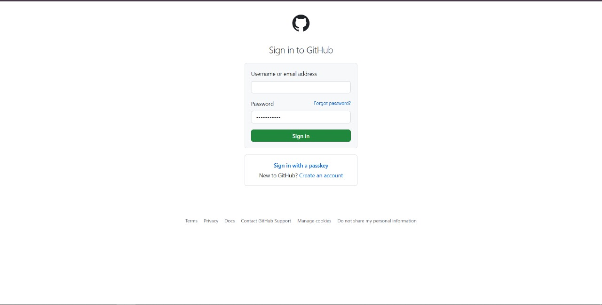
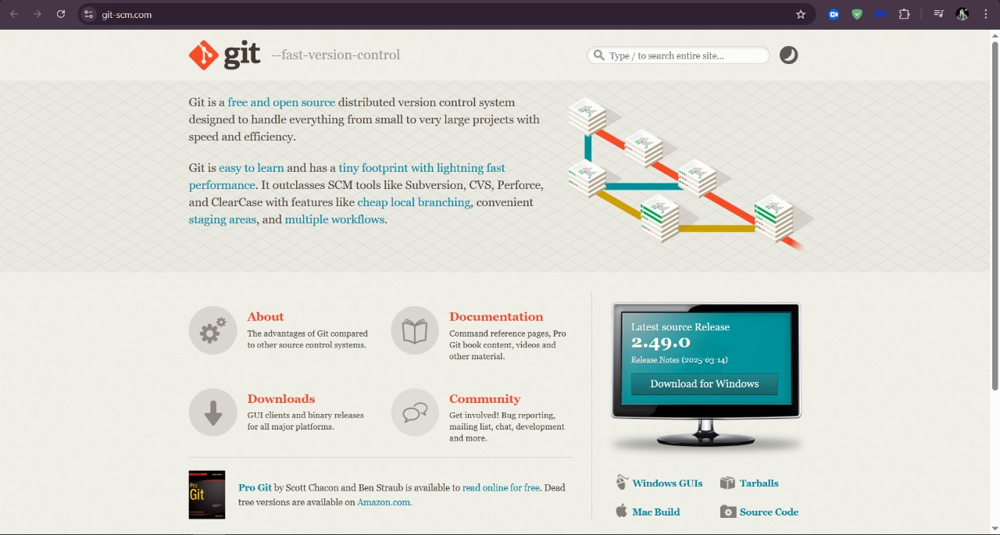
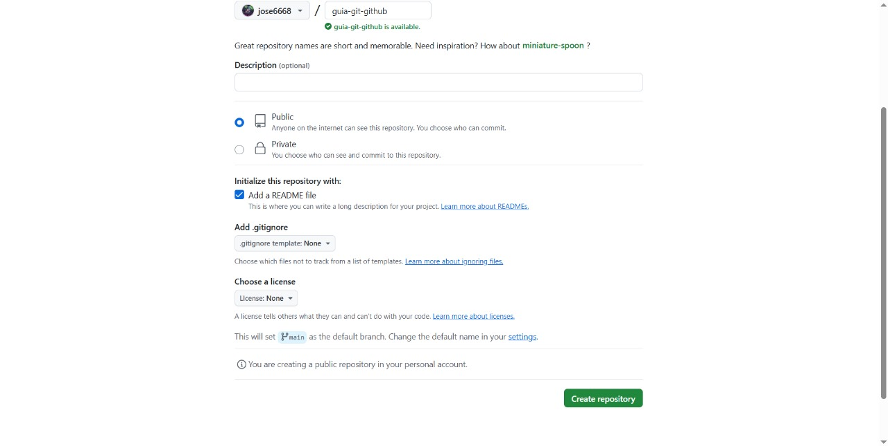
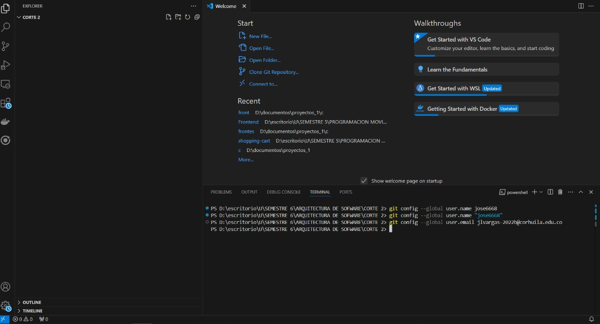
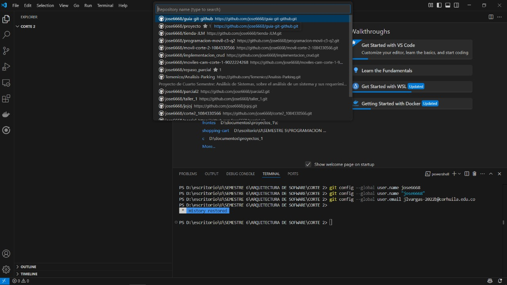
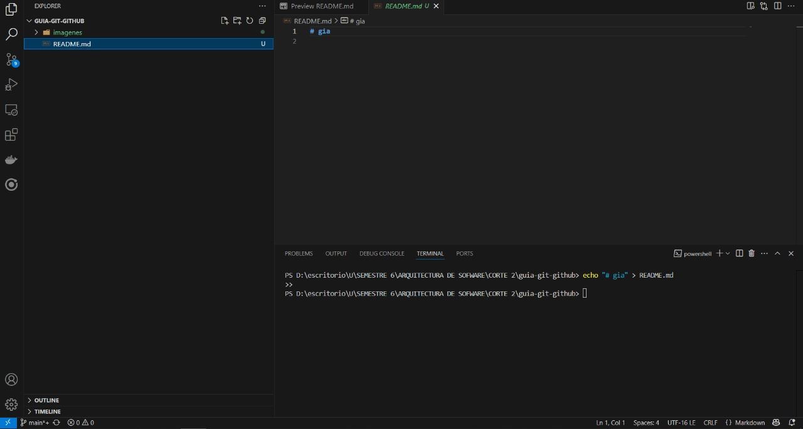
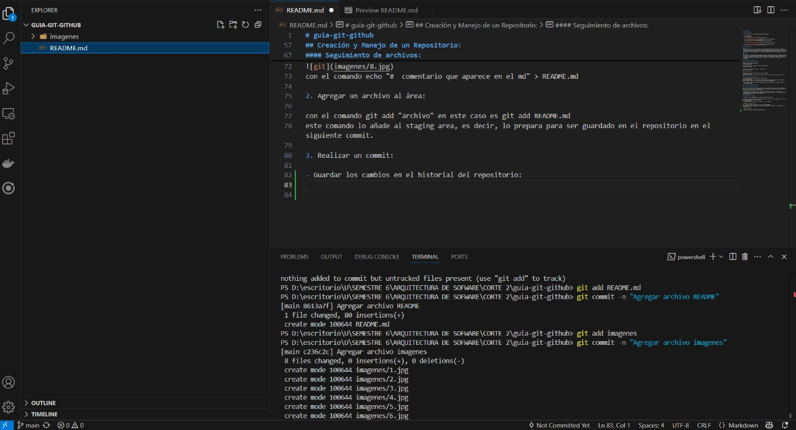
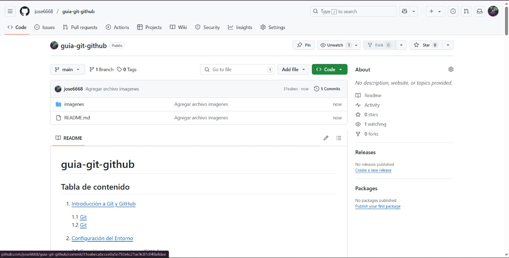

# guia-git-github

## Tabla de contenido 

1. [Introducción a Git y GitHub](#Introducción-a-Git-y-GitHub)

    1.1 [Git](#git)  
    1.2 [Git](#github)  
2. [Configuración del Entorno](#configuración-del-entorno)

    2.1 [Creación de una cuenta en GitHub](#creación-de-una-cuenta-en-github)   
    2.2 [Instalación de Git](#instalación-de-git)  
    2.3 [Configuración Inicial de Git](#configuración-inicial-de-git)

3. [Creación y Manejo de un Repositorio](#creación-y-manejo-de-un-repositorio)

    3.1 [inicializar un nuevo repositorio](#inicializar-un-nuevo-repositorio)   
    3.2 [Seguimiento de archivos](#seguimiento-de-archivos)  

## Introducción a Git y 

#### Git:
 es un sistema de control de versiones distribuido que permite gestionar los cambios en el código a lo largo del tiempo. Fue diseñado para que varios desarrolladores puedan trabajar en el mismo proyecto sin pisarse entre sí. Cada desarrollador tiene una copia completa del historial del proyecto, lo que facilita el trabajo en paralelo, la detección de errores y la recuperación de versiones anteriores si algo sale mal.

#### GitHub:
 por su parte, es una plataforma en línea donde se pueden alojar repositorios Git. Su principal valor está en facilitar la colaboración: permite compartir proyectos, revisar código, gestionar problemas (issues), y trabajar en equipo mediante funciones como pull requests. Es especialmente importante en proyectos de código abierto, donde desarrolladores de todo el mundo pueden contribuir de forma organizada y transparente.

## Configuración del Entorno

#### Creación de una cuenta en GitHub:

ingresar a [git](https://github.com/) 

ingresar a suscribirce, ingresar un correo y poner una clave. 

ingresar a iniciar sesión, introducir la cuenta creada. 

#### Instalación de Git:

ingresar a [git.download](https://git-scm.com/) para windows

descargarlo e instalarlo, la instalación es sencilla, solo toca undirle a todo siguiente y listo.

#### Configuración Inicial de Git:

1. primero debemos crear un repositorio en nuestra cuenta.

tener en cuenta ponerlo en publico para que las demas personas puedan ingresar sin niguna dificultad, ademas tambien hay que tener en cuenta chuliar la opcion de add a README file.

2. para ingresar o habrir este rapositorio debemos abrir vscode e ingresar los siguientes comandos.
 

## Creación y Manejo de un Repositorio:

#### inicializar un nuevo repositorio:

para iniciar un repocitoria hay varias maneras por ej. utilizando la terminal de vscode e ingresando el comando de git init para crear un repositorio desde cero pero para mi se me hace que es una manera muy extenza porque hay que ingresar varios comandos. 

la mejor manera para realizarlo y si contamos con conectividad a internet seria de esta manera.
- tenemos que tener en nuestra cuenta un repositorio, abrir vscode y ingresar a clone git repository por ultimo seleccionar el repositorio que desemos clonar.

#### Seguimiento de archivos:

1. Creacion ce archivo README.md con una breve descripción del proyecto:

si realizan el repositorio como se indica en esta guia por defecto el archivo README ya esta creado pero si lo desean crear es de la siguiente manera.

con el comando echo "#  comentario que aparece en el md" > README.md  

2. Agregar un archivo al área:

con el comando git add "archivo" en este caso es git add README.md 
este comando lo añade al staging area, es decir, lo prepara para ser guardado en el repositorio en el siguiente commit.

3. Realizar un commit:

- Guardar los cambios en el historial del repositorio:

primero hay que agregar los archivos que tengamos con git add en este caso son "add README.md" y "git add imagenes" y por ultimo git commit -m "Agregar archivo README"

si depronto no se guarda la informacion o no aparece en el git ingresar este comando git git push

otra manera para hacerlo es ingresar a source control y en la parte de changes undirle en el +, en la casilla de arriba ingresar  feat: update   , luego en commint y luego en syn  